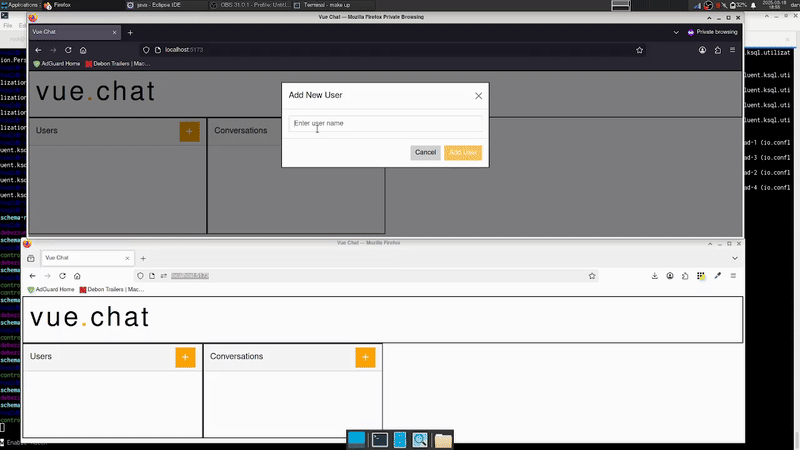
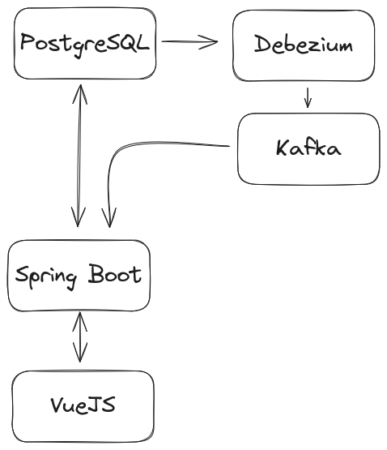
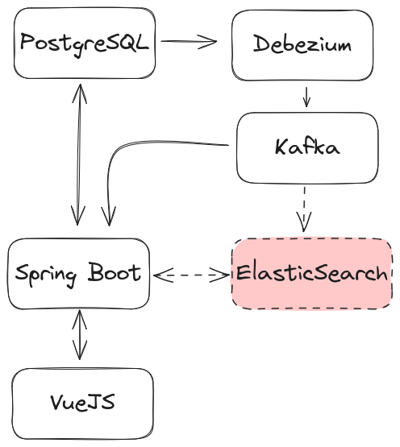

# Vue Chat

## Description

"Vue Chat" is a multi-user real time messaging application like Slack, Discord etc.

## Components

The demo includes the following components:

- **PostgreSQL**: The "source of truth".
- **Debezium**: Ingest data changes from PostgreSQL to Apache Kafka. An drop in alternative to the "transaction outbox" pattern.
- **KSQLDB**: Combines data from multiple topics.
- **Spring Boot**: A Reactive API, integrating with PostgreSQL and Kafka.
- **VueJS**: An SPA for managing users, conversations and sending/receiving messages.
- **Docker / Docker Compose**: The entire system can be built and run locally.

### Demo



## Design

First and foremost, this system is designed to show that I have a extensive knowledge across the following domains: 

* SQL and schema design with PostgreSQL.
* Data engineering with Debezium, Kafka and KSQL DB.
* Event driven architectures.
* Spring Boot APIs.
* Front End Development with JS frameworks.
* System infrastructure / networks with Docker / Docker Compose.

Secondly, the system is designed to maintain data integrity, specifically preventing the "dual write problem" encountered when working with event driven, distributed systems.

The "dual write problem" occurs when a system component needs to write to two or more data stores, in this case PostgreSQL and Kafka. When writing to one datastore, then another, there is the possibility that the application could fail or be terminated before all the datastores have been written to, this can lead to problems with data integrity. To prevent this, there is the "transaction outbox" pattern, or Debezium, amongst other tools, which sources write events from the primary data store, ensuring the data can be diseminated it to all other datastores.



In this demo, the only datastore is PostgreSQL, so this pattern may look like over-engineering, however it allows the system to be extended very easily. For example, a common requirement of messaging applications is to be able to search through previous messages, doing full text search with PostgreSQL in a system with "high throughput" could lead to significant latency, system instability and a poor user experience. Therefore, we can extend the system with a more appropriate technology, like ElasticSearch, to do full text search, whilst also maintaining data integrity.



## Getting Started

### Prerequisites

- [Docker](https://docs.docker.com/get-docker/) and [Docker Compose](https://docs.docker.com/compose/install/) installed on your machine.
- [Make](https://www.gnu.org/software/make/) installed to run build commands.

### Installation

1. **Build Docker Images**

   Build all required images by running:
   ```bash
   make build
   
2. **Start the Environment**
   
   Launch the Docker Compose environment with:
   ```bash
   make up
   
3. **Play with the Demo**

  Open your browser and navigate to [http://localhost:5173/](http://localhost:5173/).
   
